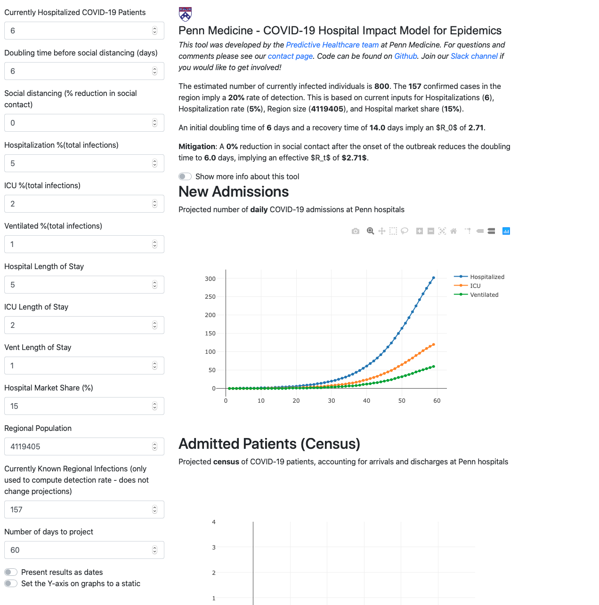

# Context

This directory provides the interface for the dash app.



## Tree

Structure of the app

* `app/components` - Initializing individual dash components (elements of a page)
* `app/pages` - Controlling different html pages
* `app/services` - Main functions, right now just `plotting.py`
* `app/static` - Initializing static content from the templates dir
* `app/templates` - Localization files, e.g., the content of web pages.
* `app/utils` - Tools useful over different components.

## How it works

A dash app consists of a general HTML layout and callback events which connect forms to html output elements like tables
and graphs. The Python layer glues this together.

### Components

The structure of this app is such that individual page components (e.g., Python equivalents of HTML elements) are
modularized as much while utilizing the same API. This is ensured by inheriting from the base `Component` class
in `app/components/base.py`.

For example, the most simple set up for a dash app is

```python
from dash_html_components import Div
from chime_dash.app.components.base import Component

class Header(Component):
    """
    """
    localization_file = "header.md" # self.content -> app/templates/LANGUAGE/header.md

    def get_html(self) -> List[ComponentMeta]:
        """Initializes the header dash html
        """
        return [Div(children=self.content)]

header = Header(LANGUAGE, DEFAULTS) # Init the component with default settings
app = Dash(__name__)
app.layout = header.html # safe calls get_html
app.run_server(debug=True)
```

Different language files are provided by translating the `en` dir to another template folder/language. For now, there is
no fallback option if a folder does not exist.

Adding different components is straight forward:

```python
...
body = Body(LANGUAGE, DEFAULTS) # also inherits from Component
app.layout += body.html
```

### Callbacks

Callbacks, e.g., interactions with the webpage are more tricky. Callbacks infer the input parameters (e.g., `forms`) and
output parameters (e.g., `div`s) by html element `id`s. This mapping is controlled by configuring the app callback

```python
@app.callback(callback_outputs, callback_inputs)
def callback(*args):
    return callback_function(*args)
```

The `callback_function` returns Python dictionaries which control the rendering of output elements.

An example for this is

```python
from dash.dependencies import Input, Output
import dash_core_components as dcc

class Form(Component):
    callback_outputs = [
        Output(
            component_id="output-id",     # write output in component with id...
            component_property="children" # change the children property
        )
    ]
    callback_inputs = {
        "form-id": Input(
            component_id="form-id",     # Pick values from component with id ...
            component_property="value"  # Select the value property
        )
    }

    def get_html(self) -> List[ComponentMeta]:
        """Returns html form plus division to display output.
        """
        return [
            dcc.Input(id="form-id", type="text"),  # The html form element
            Div(id="output-id")
        ]

    def callback(self, *args, **kwargs): -> List[Any] # Component specific action on callback
        """Parses callback data and returns children property for div
        """
        form_value = args[0] # Assumes that this component is the only callback_output
        children_data = [form_value]
        return [children_data] # return children data for div


# Add html
form = Form(LANGUAGE, DEFAULTS)
app.layout += form.html

# Set the callback to the form callback.
@app.callback(form.callback_outputs, form.callback_inputs)
def callback(*args):
    return form.callback(*args)
```

A more advanced example glueing together different components can be found in

```bash
components/__init__.py
```

## How to run the app

Install the chime base module

```bash
> pip install [--user] [-r] requirements.txt
```

and run

```bash
> PARAMETERS=defaults/webapp.cfg python src/dash_app.py
```

in the project root and visit the local url.

## Questions

Feel free to ask me in the slack channel:

* @ckoerber
